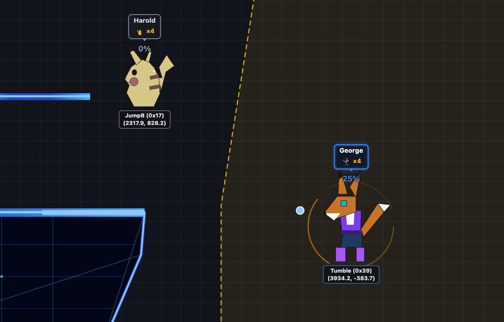

# How edge guards are defined and scored

_For the competitive SSB64 community: how rmgr-viewer decides what counts as an edge guard, and how it grades them. No code knowledge needed. Feedback is very welcome — see [Questions for you](#questions-for-you) at the end._

_Applies to: Dream Land, 1v1. Numbers below come from 356 real games (the reference replays), analysis version 5._

---

## The short version

- An **edge-guard situation** starts when one player ends up **outside a zone around the stage** and **can act again** (their hitstun has ended). The other player is the edge-guarder.
- It ends when the recovering player **loses the stock** (edge guard succeeded), or **grabs the ledge**, **stands safely on stage for half a second**, or the edge-guarder dies (edge guard failed).
- At the moment the situation starts, a **recovery simulator** asks: _could this character still make it back from here, with the best possible inputs?_ If the answer is **no**, the player was already dead and the situation is **left out** — there was nothing for the edge-guarder to do (unless a hit then saved them — see "accidental save" below).
- Every other situation gets a **score from −65 to 100**: 100 for a kill, partial credit for damage, penalties for mistakes. Your average across situations becomes a **letter grade (S / A / B / C / D / F)**.

Why this way: a plain "kill rate" treats a player who got a free stock (the opponent was already dead) the same as one who actually edge-guarded, and gives zero credit for a good edge guard that deals 40% but doesn't kill. The goal is to measure **the edge-guarding itself**, counted **per opportunity** — not per game or per stock.

---

## 1. When does an edge-guard situation start?

### The zone

Around the stage there is an invisible boundary. Inside it you're "on stage or close enough"; outside it you're recovering.

- The boundary is a slanted line on each side of the stage, going from about **x = ±2916 at stage height** (y = 58) up to **x = ±3570 high above** (y = 4158). For reference, Dream Land's ledges are at x = ±2318, so the boundary sits roughly 600 units past the ledge at stage level and widens further out as you go up.
- Below stage height the boundary stays at ±2916; above y = 4158 it stays at ±3570.
- You're **outside** when you're further from the center than the boundary at your height.

_The dashed amber line is the zone boundary on Dream Land's right side (the left side mirrors it); the tinted area beyond it is "offstage". Fox has just come out of hitstun past the line, so an edge-guard situation opens on this frame, with Pikachu waiting at the ledge. From the bundled demo replay `20260822-222803-Harold-George-37`, frame 354. You can show this boundary on any replay with the **Zone** button in the match view's Debug panel._

The slant exists because a player high above the ledge but only slightly past it isn't really in trouble yet, while a player at stage level that far out is.

### The trigger

A situation opens on the first frame where a player is **outside the zone** and **actionable** — not in hitstun (or being grabbed/thrown). In practice:

- **Knocked offstage:** the situation starts the moment their hitstun ends. If they die while still in hitstun, it was a straight **launch KO**, not an edge-guard situation — nothing the edge-guarder did offstage decided it.
- **Drifted out on their own** (e.g. after a jump or leftover momentum): it starts the moment they cross the boundary.
- **Both players outside and actionable** (e.g. the edge-guarder jumped out to chase): whoever was **most recently hit** is the one recovering. A player who jumps out to chase an opponent still in hitstun is **not** marked as recovering.
- No situation opens while either player is dead or respawning.
- Only one situation is tracked at a time.

## 2. When does it end?

| What happens                                                                | Result                                     |
| --------------------------------------------------------------------------- | ------------------------------------------ |
| The recovering player loses the stock                                       | **Edge guard succeeded** (recovery failed) |
| The recovering player grabs the ledge                                       | Edge guard failed (recovery succeeded)     |
| The recovering player lands and stays grounded and actionable for **0.5 s** | Edge guard failed                          |
| The edge-guarder loses a stock (e.g. went too deep)                         | Edge guard failed                          |
| The replay ends with the situation still open                               | Treated as a failed recovery               |

Details on the half-second rule:

- The 0.5 s clock only starts once they've actually **touched the ground**.
- Getting **hit or grabbed** resets both the clock and the "touched the ground" progress — they have to land again. (Found via a real case: a player landed, got grabbed, thrown and killed, and was wrongly counted as having recovered.)
- A voluntary jump after landing does **not** reset the clock — leaving the ground on purpose shows control, not danger.

## 3. Could they still make it back? (the recovery classifier)

When a situation starts, the app runs a **physics simulation of the recovering character's recovery** from their exact position, speed, remaining double jump and facing. It tries every reasonable way back — jump or not, which direction to drift, how long to wait before up-B (and, for Falcon, using a whiffed aerial Falcon Punch to cover distance first) — using movement values taken from the game's own code. It answers one of three things:

| Verdict           | Meaning                                                                                            |
| ----------------- | -------------------------------------------------------------------------------------------------- |
| **Reaches stage** | Some sequence of inputs lands them on the stage.                                                   |
| **Ledge only**    | They can grab the ledge but can't reach the stage — so they survive **only if the ledge is free**. |
| **Dead**          | No sequence of inputs gets them back.                                                              |

The simulator doesn't know what the edge-guarder will do; it only answers "with nobody in the way, is there a path back?"

It currently covers **9 of the original 12 characters** (Fox, Donkey Kong, Samus, Link, Yoshi, Captain Falcon, Kirby, Pikachu, Jigglypuff), in both the Japanese and US versions, on Dream Land. **Mario, Luigi and Ness aren't simulated yet.**

It's checked against real replays: across about 2,700 real recovery attempts where the player wasn't hit on the way back, there is currently **1 case** where it said "can't make it" but the player did (a Yoshi). Two recent fixes came straight from players flagging specific replays: Link's up-B was modeled as floating about twice as high as the real move, and the model didn't know about Falcon's whiffed-Falcon-Punch repositioning.

The situation then falls into one of three categories:

| Category         | When                                                      | What happens to it                                         |
| ---------------- | --------------------------------------------------------- | ---------------------------------------------------------- |
| **Hopeless**     | Verdict "dead"                                            | **Left out of scoring** — they were already dead.          |
| **Contestable**  | "Reaches stage" or "ledge only"                           | Scored normally.                                           |
| **Unclassified** | Character not simulated (Mario/Luigi/Ness), or no verdict | Scored normally, treated as if they could reach the stage. |

One exception to "hopeless is left out": if a hopeless player **survives after a hit connected**, that's scored as a possible accidental save (−50, see below) — something unexpected happened, and it's worth a look.

**Why "reaches stage" and "ledge only" are scored the same:** "reaches stage" only proves that _one_ perfect input sequence exists — it doesn't mean the recovery was easy or that edge-guard pressure didn't matter. In a 30-game sample, **21% of "reaches stage" situations still ended in a kill**; across all 356 reference games, **25% of contestable situations did**. Splitting "easy recovery" from "hard recovery" properly would need matchup-by-matchup knowledge we don't have yet, so only the one claim that holds up — **dead** — is trusted.

In the reference replays: 2,775 contestable, 87 hopeless, 588 unclassified situations (about 10 per game).

## 4. The score

Each scored situation gets exactly one base score, checked in this order:

| Outcome                                                                                                          | Points  |
| ---------------------------------------------------------------------------------------------------------------- | ------- |
| **Missed ledge-hog** — they could survive _only_ via the ledge, you didn't take the ledge, and they grabbed it   | **−10** |
| **Possible accidental save** — they should have been dead, but survived after a hit connected (either direction) | **−50** |
| **Kill** — they lost the stock                                                                                   | **100** |
| Survived, but you dealt **35% or more** during the situation                                                     | **70**  |
| Survived, you dealt **17–35%**                                                                                   | **45**  |
| Survived, you dealt **under 17%** (roughly one hit)                                                              | **20**  |
| Survived, you dealt **nothing**                                                                                  | **0**   |

Then one modifier:

- **−15 if the recovering player hit you and still got back.** Applied once per situation no matter how many hits. It does **not** apply if they died anyway — trading a hit on the way to taking the stock costs nothing.

So a situation can land anywhere from −65 (accidental save and got hit) to 100.

**Why damage counts even without a kill:** forcing a bad recovery and dealing 40% is real edge-guarding value — it just didn't finish. The damage buckets are flat amounts, not scaled by the opponent's current percent, because percent is a knockback multiplier, not a "health bar".

**Why a missed ledge-hog is worse than doing nothing:** it was a kill left on the table — the simulator says taking the ledge would have killed.

**Why an accidental save is the worst:** the opponent was dead, and a hit (from you, or theirs on you — e.g. Falcon's up-B grabbing you resets his recovery) gave them another chance. The app flags these as "worth a look", not as proof the hit caused it.

**What a kill means here:** if the classifier said they _could_ get back and they died anyway — even with no further pressure from you — it still counts as a **successful edge guard (100)**. Forcing a recovery that's hard to execute is part of edge-guarding. (It does **not** count as a _kill combo_, though — see the note at the end.)

In the reference replays the average score is **30**, and the most common outcomes are 0 (1,428 situations), 100 (910), 20 (356) and −15 (376).

### Letter grades

Your **average** score over all your scored situations becomes a letter:

| Average    | Grade                                     |
| ---------- | ----------------------------------------- |
| 100        | **S** (every scored situation was a kill) |
| 70 or more | **A**                                     |
| 45 or more | **B**                                     |
| 20 or more | **C**                                     |
| 0 or more  | **D**                                     |
| below 0    | **F**                                     |

The boundaries match the tiers, so if every situation lands on one tier you get that tier's letter. Averages are pooled across all situations in the games you're looking at (total points ÷ total situations), never an average of per-game grades — one game with 1 situation shouldn't weigh as much as a game with 8.

## 5. Where you see it in the app

- **Game list:** each game shows an `EG` chip with your grade and how many situations were scored, e.g. `EG D (5)`.
- **Library stats and the matchup page:** "Edge Guard Effectiveness" — your pooled grade across the selected games, and how it compares to your overall average.
- **Matchup page:** also "Edge Guard Conversion" — a plain kill rate: how often the opponent failed to recover, out of situations that weren't hopeless.
- **Match view:** the "Edge Guard" panel shows your effectiveness for the game and a breakdown of hopeless / contestable / unclassified situations, and lists each situation with its score so you can jump to it. Hopeless situations get a `hopeless` badge, and the two warning flags show as `⚠ ledge hog` and `⚠ accidental save?`. The live overlay shows the classifier's verdict as it happens: a highlighted ledge for "ledge only", a skull for "dead".
- **Clip search:** the "Edge Guards" search finds every situation (filterable by success/failure, players, characters, jumps left, and where the recovering player started) and plays them back to back.

## Worked examples

(1 and 2 are real moments from the reference replays; 3 is illustrative.)

1. **Hopeless — left out.** `260913121225-Sekirei-nue-11`, frame 2734. Link comes out of hitstun about 5,250 units past the ledge, slightly below stage level, with his double jump. The simulator (after the Spin Attack fix) finds no way back → **hopeless**, not scored. He fast-fell and died, but that stock was already lost when he was hit there; nue gets no edge-guard credit for it.
2. **Contestable, died without pressure — full credit.** `260828205834-nue-Kurabba-29`, from frame 4558. Pikachu comes out of a Kirby combo in a position the simulator rates **reaches stage**. Kirby does nothing further; Pikachu double-jumps, charges a Quick Attack in place, and falls to his death. → **Kill, 100** for Kirby's edge guard (but not a kill combo).
3. **Survived with damage.** A player knocked out, hit twice for 22% on the way back, grabs the ledge → **45**. If they had hit you on the way back too → **30**.

## Known limits

- **Dream Land 1v1 only.** Other stages have different ledges and blast zones.
- **Mario, Luigi and Ness** aren't simulated — their situations are scored as if they could always reach the stage.
- The simulator assumes a **free ledge**; it doesn't model the edge-guarder being in the way except through the "ledge only" verdict.
- **Straight-down spikes** that stay inside the zone horizontally may never open a situation.
- **Contestable is broad** — a trivially easy recovery and a nearly impossible one are scored the same.
- The **damage thresholds (17 / 35)** and **point values** are design choices, not derived from data.
- Only **one situation at a time** is tracked.

## Questions for you

We'd especially like opinions on:

1. **Is the zone boundary in the right place?** Are there common edge-guard scenarios (e.g. deep offstage chases, low recoveries under the stage, spikes) that it misses or mis-times?
2. **Should a kill with no pressure count the same as a hard-earned one?** Right now both are 100 if the classifier said the recovery was possible.
3. **Should "reaches stage" and "ledge only" be split** — and if so, how would you judge how hard a recovery is in a given matchup?
4. **Are the point values fair?** 70 / 45 / 20 for damage, −10 for a missed ledge-hog, −50 for an accidental save, −15 for getting hit and letting them back.
5. **Do the damage thresholds (17% and 35%) match what you'd call "a hit" and "a real punish" offstage?**
6. **Recovery techniques the simulator might not know about.** The Falcon Punch fix came from a player flagging a replay — if you see a verdict that's wrong (a skull on someone who made it, or no skull on someone who had no chance), please send the replay name and frame.

---

_A note on kill combos: the game list also shows "Kill Combos". A combo only counts as a kill combo if the combo itself took the stock, or left the opponent in a position the simulator rates **dead**. If it left them with a real way back and they died anyway, it counts as a successful edge guard (above) but not as a kill combo._
